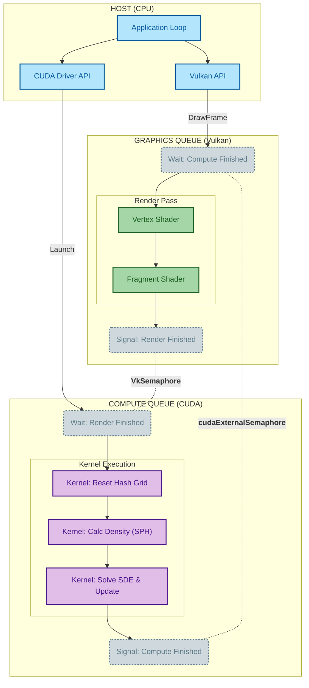

https://github.com/user-attachments/assets/9d686add-b5a1-4562-bcfc-95cc003162f5
# Real-Time Market Microstructure Simulation


This project models the market microstructure for a tradeable asset (e.g., a stock or commodity) by simulating hundreds of thousands of individual rational agents in real-time. Each agent is modeled with distinct trading goals, risk aversion, and "greed", interacting within a physics-based limit order book environment.

Unlike simple backtesters that replay historical data, this simulation models the dynamic market impact of every trade. Agent velocity drives price evolution, which reciprocally reshapes optimal strategies, allowing the system to reach a dynamic equilibrium.

Crucially, the simulation treats market liquidity as a physical fluid. Using Smoothed Particle Hydrodynamics (SPH)—a technique typically used for water simulation—it models "liquidity congestion." When too many traders cluster at a specific price level, local execution costs rise, forcing agents to slow down. This creates a natural throttling mechanism similar to incompressible fluids. By explicitly modeling these impact dynamics, the system serves as potential a stress-test benchmark for execution algorithms under realistic feedback conditions, or at the very least a PoC.

## Demo

Visualization of agent inventory (y axis) vs. execution cost (x axis). Color indicates continuous trading speed: red for sellers, green for buyers. Top-left: aggregate market pressure and price.

<div align="center">
  <video src="https://github.com/user-attachments/assets/226fa001-5e23-4d3b-a44d-227098cda3da" width="75%" autoplay loop muted></video>
  <p>
    <i>100K agents, 50% buyers, 60FPS at 2x speed.</i> <br />
      The wave patterns are an emergent artifact of low temporary market impact combined with high congestion sensitivity. Essentially, while the immediate cost of crossing the spread is low, the cost of 'traffic' is high. Agents rush into a price level, spike the local density, and are forced to retreat like a compressible fluid hitting a wall, creating these oscillating pressure waves.
  </p>
</div>

<br>

<h3>Some less stable, but interesting examples:</h3>

<table width="100%">
  <tr>
    <td width="50%" align="center">
      <video src="https://github.com/user-attachments/assets/0afb338b-b937-48c7-9cf1-807a3be02338" width="100%" autoplay loop muted controls></video>
      <br>
      <sub><i>100K agents, 50/50. Zoomed in 10x.</i></sub>
    </td>
    <td width="50%" align="center">
      <video src="https://github.com/user-attachments/assets/62281e5c-3a3f-47c6-8f11-626331cfdbd1" width="100%" autoplay loop muted controls></video>
      <br>
      <sub><i>100K agents, 100% sellers. Taders far from the crowd sell quickly until they reach the crowd.</i></sub>
    </td>
  </tr>
</table>


---

## Features

- Highly Configurable: Almost all parameters contributing to the final result are configurable through the command line arguments. This allows you to tune parameters for simulation as well as for rendering.
- Symmetric Control Policy: there is no distinction between buyers and sellers. Each agent has an initial and target inventory. Sellers are motivated to liquidate and buyers to build a position.
- Realtime And Headless Rendering: if your GPU can handle it and you have a desktop, you can enjoy the show as it's computed and receive immediate visual feedback. Otherwise, in headless mode, the simulation tick rates are decoupled from the frame rate. Individual frames can be rendered and stored separately and then pieced together into a video using `ffmpeg`.

## Architecture

The core constraint of this project is the 16.6ms frame budget (60 FPS). As the agent count increases, the simulation and rendering steps compete for this tiny slice of time. The single biggest bottleneck to avoid is the PCIe bus - copying data between CPU and GPU is simply too slow.

To solve this, we enforce a strict **'Zero-Copy' policy**: data never leaves the GPU. We use CUDA for the simulation physics and Vulkan for the graphics. Since these APIs don't share state by default, we implement an explicit interop pipeline. Vulkan allocates the memory buffers and exports them via file descriptors to CUDA. We then use semaphores to synchronize the two, ensuring the simulation finishes computing exactly before the renderer starts drawing.

Below is a rough sketch:



---

## Prerequisites

- **Linux** system
- **CMake**: 3.18 or higher.
- **C++ Compiler**: GCC 9+ or Clang 10+ (supporting C++17).

### Core Engine

- **CUDA Toolkit**: 11.5 or newer. The computational backbone. `cuRAND` used for generating high-quality entropy, driving the brownian motion of the price and randomly sampled parameters.
- **Vulkan SDK**: 1.2 or newer. The graphics backend. Chosen over OpenGL for its explicit control over memory allocation. Allows the allocation of device-local memory that is yet exportable to CUDA, which is required for the zero-copy architecture.

### Visualization & UI

- **GLFW3** (`libglfw3-dev`): Handles window creation and input context.
- **GLM** (`libglm-dev`): Header-only math library used for camera projection and cooridnate transformation within the rendering pipeline.
- **ImGui & ImPlot**: Used for the overlay containing the live line charts showing the evolution of aggregate market pressure and price evolution.

### Validation & Profiling

- **GoogleTest**: Unit testing framework. Used for verifying the mathematical correctness of the simulation.
- **Google Benchmark**: Used to profile critical kernels.

---

## Building & Running

make sure you clone the source code for imgui and implot in a directory named `vendor` at the root, and the remaining dependencies are installed on your system.

### Build

```bash
make
```

### Run Simulation

```bash
# Run real-time visualization
make run

# Run in headless mode (outputs PPM frames to output/)
./build/venturi --headless
```

### Command Line Arguments

```bash
coming soon...
```

### Generate Demo Video

After running in headless mode:

```bash
make ffmpeg
```

## Tests & Benchmarks

Venturi includes a comprehensive suite of unit tests and performance benchmarks to ensure physical accuracy and rendering speed.

### Running Tests

```bash
make test
```

### Running Benchmarks

```bash
make benchmark
```

### Profiling

To determine the maximum agent capacity for your hardware or detail performance:

```bash
# Find max agents for 30/60 FPS target
./build/venturi_max_agents

# Profile simulation steps with custom parameters
./build/venturi_profile --num_agents 50000 --num_steps 1000
```

## Future Work

- **Interactive UI**: Adding parameter sliders to adjust Risk/Greed in real-time.
- **Camera Control**: Implementing free-cam movement to explore local clusters.
- **Optimize Spatial Hashing**: Seems to be the performance bottleneck, especially as agents converge to the center and get closer to each other. Started from sorting by sorting by spatial hash for better memory coalescence, though the current linked list approach proves to be faster. I think there's still room for improvement.
- Currently the agents are undisturbed. Once the initial parameters are set nothing really gets in their way to reach their target inventory other than local congestion and their risk aversion. It'd be interesting to throw in disruptions at random or will. Could maybe simulate a crash?
